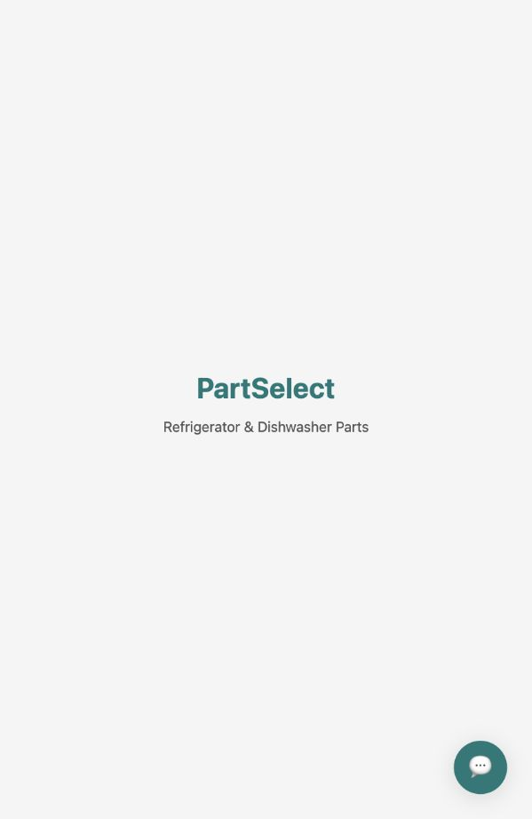
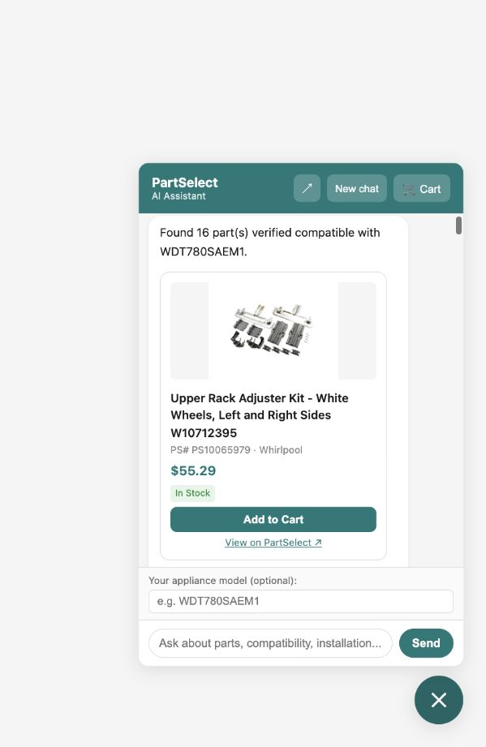
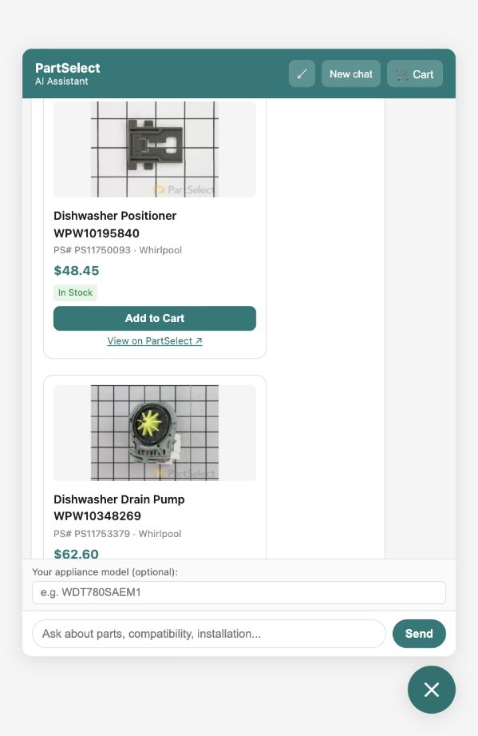
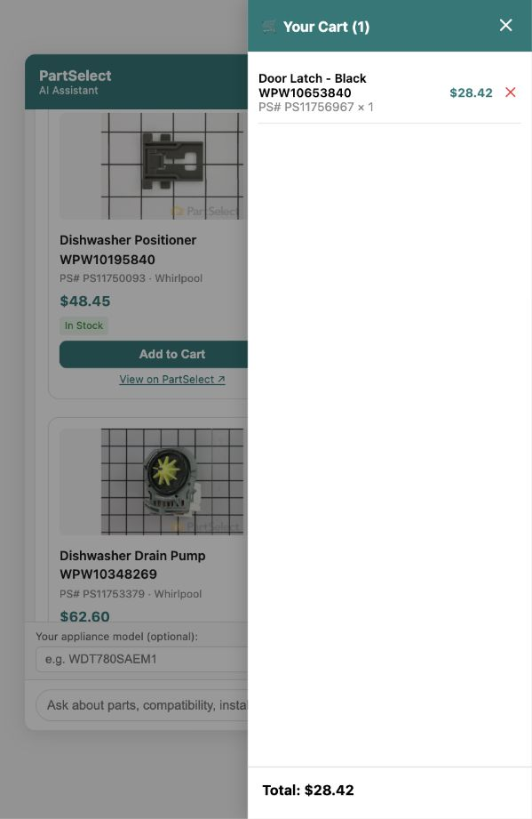
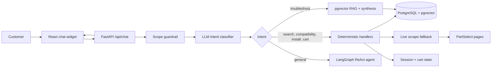
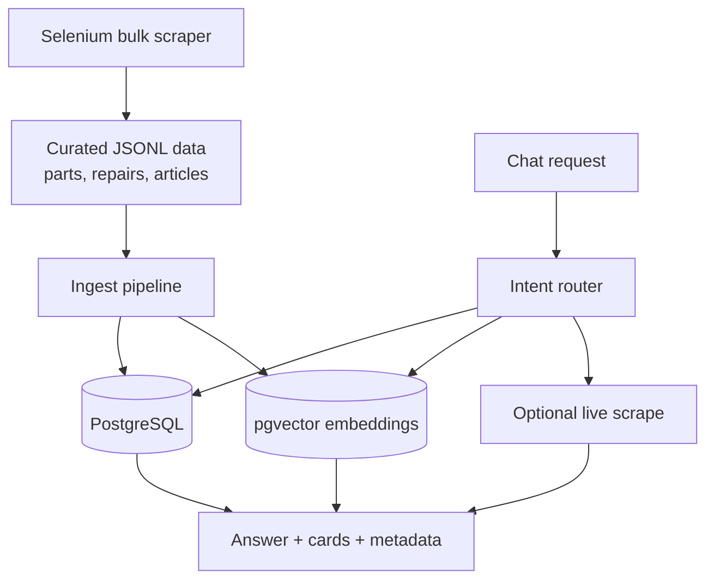

# PartSelect AI Chat Agent

AI assistant for PartSelect-style appliance part shopping. It helps customers find refrigerator and dishwasher parts, verify compatibility, read installation guidance, troubleshoot symptoms, and manage a session cart from a compact embeddable chat widget.



## What it can do

| Capability | What the user asks | What the system returns |
|---|---|---|
| Find parts | "Show parts for WDT780SAEM1" | Compatible product cards with images, price, stock, PS number, and PartSelect links |
| Check compatibility | "Is PS11752778 compatible with my WDT780SAEM1?" | Deterministic compatibility result from PostgreSQL |
| Installation help | "How do I install PS11752778?" | Step-by-step installation guidance from catalog data |
| Troubleshooting | "My ice maker is not working" | RAG answer grounded in repair guides and articles |
| Cart actions | "Add it" / "remove the filter" | Session-aware cart updates grounded in recently shown parts |
| Live fallback | Missing model or part data | Optional Selenium or Firecrawl runtime scrape |

## Demo screenshots

| Floating widget | Expanded chat | Cart drawer |
|---|---|---|
|  |  |  |

## How it works



The architecture is deterministic-first. Critical flows such as install, compatibility, catalog lookup, and cart updates use direct handlers instead of depending on an agent to choose the right tool. LLMs are used where they add value: fast structured intent classification and natural-language troubleshooting synthesis.

## Data flow



## Quickstart

```bash
cp .env.example .env
# Set OPENROUTER_API_KEY in .env for intent classification and LLM synthesis.

docker compose up -d

# Open the test app:
open http://localhost:3000
```

The repo ships with curated raw data in `backend/data/raw/`, so reviewers can run a meaningful test without running the full scraper. First startup ingests the JSONL into Postgres and builds local MiniLM embeddings.

## Good test queries

```text
Show parts for WDT780SAEM1
Is PS11752778 compatible with my WDT780SAEM1 model?
How can I install part number PS11752778?
My ice maker is not working
Find wheels for my dishwasher
WDT780SAEM1
Add it to my cart
```

## Tech stack

| Layer | Tools |
|---|---|
| Frontend | React chat widget, SSE streaming, product cards, cart drawer |
| Backend | FastAPI, deterministic intent handlers, LangGraph for general fallback |
| Data | PostgreSQL 16, pgvector HNSW, JSONL ingest, session and cart tables |
| Retrieval | `sentence-transformers/all-MiniLM-L6-v2` embeddings |
| LLMs | OpenRouter models: flash classifier and pro synthesis |
| Scraping | Selenium bulk pipeline, optional Firecrawl/Selenium runtime fallback |
| Infra | Docker Compose with backend, frontend, Postgres, Redis |

## Repository map

```text
partselect-agent/
├── backend/              # FastAPI app, agent handlers, ingest, scrapers, tests
├── frontend/             # React embeddable chat widget
├── docs/
│   ├── DETAILED_README.md
│   ├── test/
│   └── assets/
├── config.toml           # LLM, catalog, retrieval, live scrape settings
└── docker-compose.yml
```

## More detail

- [Detailed implementation README](docs/DETAILED_README.md)
- [Quick test deck](docs/demo/PartSelect_AI_Chat_Agent_Demo.pptx)

